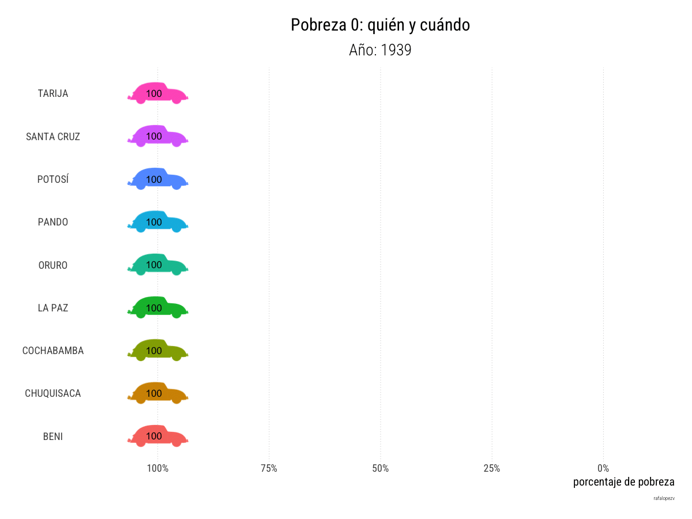

# About

I wanted to explore a more dynamic representation of progress over time, aligning it with the concept of a race, as opposed to traditional bar race plots often used for similar data. This visualization depicts the annual rate of poverty reduction in each of Bolivia’s departments.

# Result

